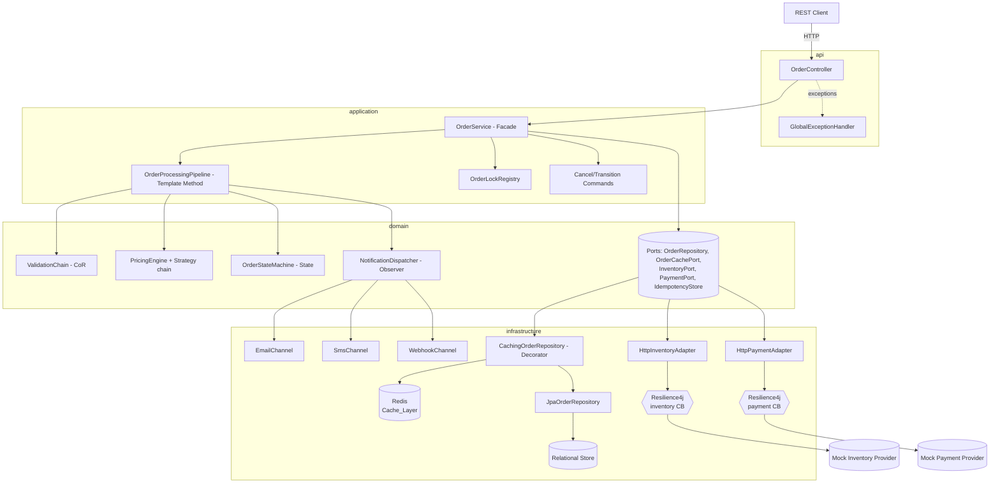
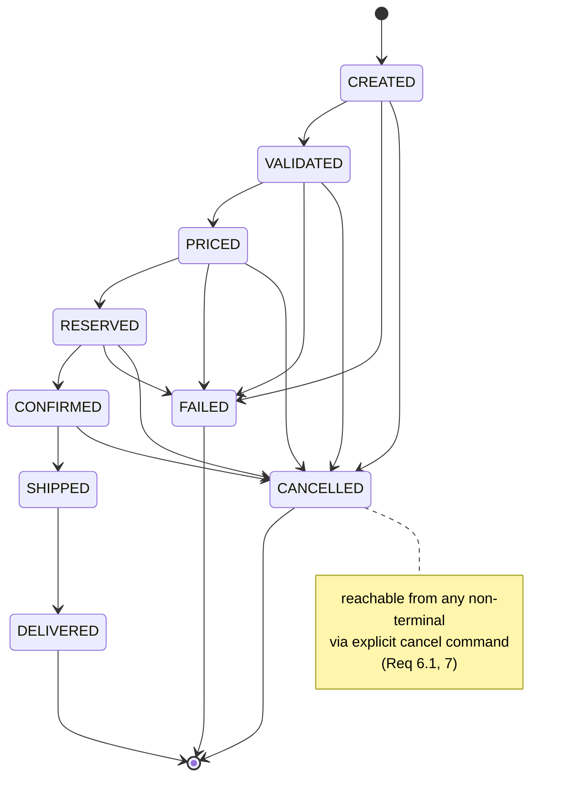

# Design Document

## Overview

The Dynamic Order Processing Service is a single Spring Boot 3.2+ application running on Java 21 that ingests order-creation requests, drives each order through a deterministic lifecycle (CREATED → … → DELIVERED, with FAILED/CANCELLED terminals), and exposes Orders via a REST API. It is built around three engineering pillars:

1. **Maintainability** — a layered hexagonal architecture, deliberate use of GoF patterns (Builder, Factory Method, Adapter, Facade, Decorator, Strategy, Observer, Chain of Responsibility, State, Command, Template Method), and SOLID principles enforced by ports/abstractions in the domain layer.
2. **Scalability** — a Redis cache-aside layer for `GET /orders/{id}`, and Java 21 virtual threads for both Tomcat request handling and the internal pipeline executor, with per-`Order_ID` striped locking to preserve lifecycle ordering.
3. **Robustness** — Resilience4j circuit breakers around every external dependency (inventory, payment, cache), fail-fast HTTP 503 responses, and an `OrderStatusEvent` audit log of every accepted state transition.

The service is intentionally self-contained: external inventory and payment providers are reached through domain-owned adapter ports, and the production wiring uses mock HTTP adapters that conform to the same ports.

### Design decisions and rationale

- **Hexagonal layering (api / application / domain / infrastructure)** keeps the domain free of Spring, JPA, Redis, and Resilience4j types so unit and property tests can run without the container. This is the structural backbone for SRP and DIP.
- **Synchronous, stage-by-stage pipeline** rather than an async event bus. Each request drives the lifecycle inline on a virtual thread up to the point where the state needs to be persisted; this preserves linear traceability per `Order_ID` and matches the synchronous POST/PUT semantics in Requirement 6 and Requirement 11.3 (per-Order serialization).
- **Single relational store + Redis cache-aside** instead of CQRS. Requirements 9 and 10 specify cache-aside read-through with invalidation on write — that is exactly cache-aside, not a separate read model.
- **Resilience4j over manual circuit-breaker code.** The library satisfies Requirement 12.2–12.6 directly and exposes Micrometer metrics that satisfy Requirement 16.3.
- **Virtual threads for both web and pipeline.** Requirement 11 makes virtual threads non-negotiable, and Spring Boot 3.2+ exposes `spring.threads.virtual.enabled=true` plus an explicit `Executor` bean so virtual threads also back the pipeline executor.

## Architecture

### Module / package layout

The service ships as one Maven module with the standard Maven layout (`src/main/java`, `src/main/resources`, `src/test/java`, `src/test/resources`) so that `mvn clean verify` from the repository root runs the full quality gate.

```
order-processing-service/
├── pom.xml
└── src/
    ├── main/
    │   ├── java/com/example/orderprocessing/
    │   │   ├── OrderProcessingApplication.java          # @SpringBootApplication
    │   │   ├── api/                                     # web layer (REST)
    │   │   │   ├── OrderController.java
    │   │   │   ├── dto/                                 # request/response records
    │   │   │   └── error/GlobalExceptionHandler.java
    │   │   ├── application/                             # orchestration / use cases
    │   │   │   ├── OrderService.java                    # Facade
    │   │   │   ├── OrderProcessingPipeline.java         # Template Method
    │   │   │   ├── command/                             # Command pattern
    │   │   │   │   ├── OrderCommand.java
    │   │   │   │   ├── CreateOrderCommand.java
    │   │   │   │   ├── CancelOrderCommand.java
    │   │   │   │   └── TransitionOrderCommand.java
    │   │   │   └── concurrency/OrderLockRegistry.java   # per-Order_ID striped locks
    │   │   ├── domain/                                  # pure domain (no Spring)
    │   │   │   ├── model/
    │   │   │   │   ├── Order.java                       # aggregate root
    │   │   │   │   ├── OrderBuilder.java                # Builder
    │   │   │   │   ├── OrderItem.java                   # record
    │   │   │   │   ├── Money.java                       # value object
    │   │   │   │   ├── OrderStatus.java                 # enum
    │   │   │   │   └── OrderStatusEvent.java            # audit record
    │   │   │   ├── lifecycle/
    │   │   │   │   ├── OrderState.java                  # State pattern
    │   │   │   │   ├── OrderStateMachine.java           # transition guard
    │   │   │   │   └── states/                          # Created, Validated, ...
    │   │   │   ├── pricing/
    │   │   │   │   ├── PricingEngine.java
    │   │   │   │   ├── PricingStrategy.java             # Strategy port
    │   │   │   │   ├── PricingStrategyChainFactory.java # Factory Method
    │   │   │   │   └── strategies/                      # Discount, Tax, Shipping, NoOp
    │   │   │   ├── validation/
    │   │   │   │   ├── ValidationRule.java
    │   │   │   │   ├── ValidationChain.java             # Chain of Responsibility
    │   │   │   │   └── rules/                           # individual rules
    │   │   │   ├── notification/
    │   │   │   │   ├── OrderEventListener.java          # Observer
    │   │   │   │   ├── NotificationDispatcher.java      # Subject
    │   │   │   │   └── NotificationChannel.java
    │   │   │   └── port/                                # SPI for infrastructure
    │   │   │       ├── OrderRepository.java
    │   │   │       ├── OrderCachePort.java
    │   │   │       ├── InventoryPort.java
    │   │   │       ├── PaymentPort.java
    │   │   │       └── IdempotencyStore.java
    │   │   ├── infrastructure/
    │   │   │   ├── persistence/                         # JPA adapter
    │   │   │   │   ├── JpaOrderRepository.java
    │   │   │   │   ├── OrderJpaEntity.java
    │   │   │   │   ├── OrderItemJpaEntity.java
    │   │   │   │   ├── OrderStatusEventJpaEntity.java
    │   │   │   │   ├── IdempotencyRecordJpaEntity.java
    │   │   │   │   └── JpaIdempotencyStore.java
    │   │   │   ├── cache/                               # Redis adapter
    │   │   │   │   ├── RedisOrderCache.java
    │   │   │   │   └── CachingOrderRepository.java      # Decorator
    │   │   │   ├── inventory/                           # Adapter
    │   │   │   │   ├── HttpInventoryAdapter.java
    │   │   │   │   └── InventoryClientConfig.java
    │   │   │   ├── payment/                             # Adapter
    │   │   │   │   ├── HttpPaymentAdapter.java
    │   │   │   │   └── PaymentClientConfig.java
    │   │   │   ├── notification/
    │   │   │   │   ├── EmailNotificationChannel.java
    │   │   │   │   ├── SmsNotificationChannel.java
    │   │   │   │   └── WebhookNotificationChannel.java
    │   │   │   └── resilience/
    │   │   │       └── CircuitBreakerConfig.java        # Resilience4j wiring
    │   │   └── config/
    │   │       ├── ExecutorConfig.java                  # virtual-thread executor bean
    │   │       ├── CacheConfig.java                     # RedisTemplate, TTL
    │   │       └── ObservabilityConfig.java
    │   └── resources/
    │       └── application.yml
    └── test/
        ├── java/com/example/orderprocessing/
        │   ├── unit/                                    # JUnit 5
        │   ├── property/                                # jqwik property tests
        │   ├── slice/                                   # @WebMvcTest, @DataJpaTest, @DataRedisTest
        │   └── integration/                             # full lifecycle + breaker
        └── resources/
            └── application-test.yml
```

### Layer responsibilities (SRP boundaries)

| Layer | Responsibility | Depends on |
|---|---|---|
| `api` | HTTP binding, DTO ↔ domain mapping, error translation | `application` |
| `application` | Use-case orchestration, lifecycle pipeline, concurrency control | `domain` (ports + model only) |
| `domain` | Business rules, lifecycle invariants, pricing, validation, notifications | nothing (pure Java) |
| `infrastructure` | Concrete adapters for DB, Redis, HTTP clients, Resilience4j | `domain` ports |

`domain` has zero Spring/Jakarta/Redis imports; this is what enforces DIP and what makes the property tests in Requirements 18 and 20 runnable as plain `jqwik` tests.

### Component diagram (Mermaid)



All threads servicing a request and all pipeline stage executions are dispatched on the virtual-thread executor; this is a runtime concern not represented in the static component graph.

## Components and Interfaces

This section names every concrete class and the GoF pattern it realizes. It also calls out the SOLID seam each abstraction defends.

### Pattern Inventory (preview — full inventory will live in `docs/PATTERNS.md` per Requirement 17.2)

| Category | Pattern | Implementing classes (FQN suffix) | Rationale | Requirement |
|---|---|---|---|---|
| Creational | **Builder** | `domain.model.OrderBuilder` building `domain.model.Order` | `Order` has many fields with invariants (status, totals, idempotency key); builder enforces required fields and immutable construction. | 13.1 |
| Creational | **Factory Method** | `domain.pricing.PricingStrategyChainFactory` producing an ordered `List<PricingStrategy>` | Pricing strategy chain is configuration-driven; factory builds the chain from a profile name without exposing strategy types to `PricingEngine`. | 13.1, 3.2 |
| Structural | **Adapter** | `infrastructure.inventory.HttpInventoryAdapter` (impl `domain.port.InventoryPort`), `infrastructure.payment.HttpPaymentAdapter` (impl `domain.port.PaymentPort`) | Translates external/mock provider HTTP/JSON shapes into the domain ports `InventoryPort`/`PaymentPort`. | 13.2, 13.5, 4, 5 |
| Structural | **Decorator** | `infrastructure.cache.CachingOrderRepository` decorating `infrastructure.persistence.JpaOrderRepository`, both implementing `domain.port.OrderRepository` | Adds Redis cache-aside behavior to the JPA repository without modifying it (OCP); circuit-breaker wrapping is handled by Resilience4j AOP at the adapter call sites. | 13.2, 9.3–9.5 |
| Structural | **Facade** | `application.OrderService` | Single entry point used by the controller; hides pipeline, lock registry, repositories, and adapters. | 13.2 |
| Behavioral | **Strategy** | `domain.pricing.PricingStrategy` with `DiscountStrategy`, `TaxStrategy`, `ShippingStrategy`, `NoOpStrategy` | Pluggable pricing algorithms. | 13.3, 13.4, 3.2 |
| Behavioral | **Observer** | `domain.notification.NotificationDispatcher` (Subject) emitting to `OrderEventListener` implementations: `EmailNotificationChannel`, `SmsNotificationChannel`, `WebhookNotificationChannel` | Notification channels are registered, not hard-coded; new channels added without touching the dispatcher. | 13.3, 13.6, 8 |
| Behavioral | **Chain of Responsibility** | `domain.validation.ValidationChain` over `ValidationRule` implementations: `NonEmptyItemsRule`, `PositiveQuantityRule`, `KnownSkuRule`, `IdempotencyRule` | Add a rule by adding a class; consumers don't change. | 2, 14.2 |
| Behavioral | **State** | `domain.lifecycle.OrderState` with `CreatedState`, `ValidatedState`, `PricedState`, `ReservedState`, `ConfirmedState`, `ShippedState`, `DeliveredState`, `CancelledState`, `FailedState`; orchestrated by `OrderStateMachine` | Lifecycle transitions and "is terminal?" checks live with each state, not in a giant switch. | 6 |
| Behavioral | **Command** | `application.command.OrderCommand` with `CreateOrderCommand`, `CancelOrderCommand`, `TransitionOrderCommand` | Encapsulates each lifecycle action so it can be queued behind the per-Order lock and audited. | 6.3, 7 |
| Behavioral | **Template Method** | `application.OrderProcessingPipeline` defines the fixed sequence (validate → price → reserve → pay → notify); subclasses or strategies fill in steps | Pipeline shape is fixed; per-stage logic is pluggable. | 13.3 |

This inventory satisfies "at least 2 of each category" (Requirement 13.1–13.3) and explicitly lists Adapter (13.5), Strategy (13.4), and Observer (13.6).

### Domain ports (Dependency Inversion seams)

```java
// domain/port/OrderRepository.java
public interface OrderRepository {
    Optional<Order> findById(OrderId id);
    Order save(Order order);                      // upsert
    void appendStatusEvent(OrderStatusEvent e);
    Page<Order> search(OrderQuery query, Pageable p);
}

// domain/port/OrderCachePort.java
public interface OrderCachePort {
    Optional<Order> get(OrderId id);
    void put(OrderId id, Order order);            // idempotent (Req 19)
    void evict(OrderId id);
    boolean isAvailable();                        // for cache-degraded path
}

// domain/port/InventoryPort.java
public interface InventoryPort {
    ReservationResult reserve(OrderId id, List<OrderItem> items);
    void release(OrderId id, List<OrderItem> items);
}

// domain/port/PaymentPort.java
public interface PaymentPort {
    AuthorizationResult authorize(OrderId id, Money grandTotal);
    void voidAuthorization(OrderId id);
}

// domain/port/IdempotencyStore.java
public interface IdempotencyStore {
    Optional<OrderId> findExisting(IdempotencyKey key);
    void register(IdempotencyKey key, OrderId id);
}
```

These are the abstractions Requirement 14.3 (DIP) calls out: every collaborator has at least one production and one test implementation, so consumers depend on the interface.

### Application layer

```java
// application/OrderService.java  (Facade)
public class OrderService {
    Order create(CreateOrderRequest req, Optional<IdempotencyKey> key);
    Order get(OrderId id);                        // cache-aside via OrderRepository
    Page<OrderSummary> list(OrderQuery q, Pageable p);
    Order cancel(OrderId id, String reason);
    List<OrderStatusEvent> events(OrderId id);
}

// application/OrderProcessingPipeline.java  (Template Method)
public abstract class OrderProcessingPipeline {
    public final Order run(Order order) {
        Order v = validate(order);
        Order p = price(v);
        Order r = reserve(p);
        Order c = pay(r);
        notify(c);
        return c;
    }
    protected abstract Order validate(Order o);
    protected abstract Order price(Order o);
    protected abstract Order reserve(Order o);
    protected abstract Order pay(Order o);
    protected abstract void notify(Order o);
}
```

`OrderService.create` always runs inside `OrderLockRegistry.withLock(orderId, () -> …)` (see "Concurrency").

## Data Models

### Domain model (Java records and aggregate)

```java
public record OrderId(UUID value) {}
public record Sku(String value) {}
public record Money(BigDecimal amount, Currency currency) {
    public Money { /* require amount.scale() <= 4, currency != null */ }
    public Money plus(Money other)  { /* same currency */ }
    public Money minus(Money other) { /* same currency */ }
}
public record OrderItem(Sku sku, int quantity, Money unitPrice) {
    public OrderItem { if (quantity < 1) throw new IllegalArgumentException(); }
}
public record IdempotencyKey(String value) {}

public enum OrderStatus {
    CREATED, VALIDATED, PRICED, RESERVED, CONFIRMED,
    SHIPPED, DELIVERED, CANCELLED, FAILED;
    public boolean isTerminal() {
        return this == DELIVERED || this == CANCELLED || this == FAILED;
    }
}

public record OrderStatusEvent(
    OrderId orderId,
    OrderStatus from,
    OrderStatus to,
    Instant at,
    String actor,        // "system" | "customer:{id}" | "operator:{id}"
    String reason        // optional
) {}

public final class Order {
    private final OrderId id;
    private final List<OrderItem> items;
    private final OrderStatus status;
    private final Money subtotal;
    private final Money discountTotal;
    private final Money taxTotal;
    private final Money shippingTotal;
    private final Money grandTotal;
    private final Optional<IdempotencyKey> idempotencyKey;
    private final Instant createdAt;
    private final Instant updatedAt;
    private final Optional<String> failureReason;
    // package-private constructor; built via OrderBuilder
    public Order withStatus(OrderStatus newStatus) { /* returns new immutable Order */ }
    public Order withTotals(Money sub, Money disc, Money tax, Money ship, Money grand) { ... }
    public Order withFailure(String reason) { ... }
}
```

`Order` is immutable; every transition produces a new instance, which makes the property tests in Requirements 18 and 20 trivial to write.

### Persistence model (JPA entities)

| Entity | Columns (key ones) | Notes |
|---|---|---|
| `OrderJpaEntity` | `id UUID PK`, `status VARCHAR`, `subtotal_amount NUMERIC`, `discount_total_amount`, `tax_total_amount`, `shipping_total_amount`, `grand_total_amount`, `currency CHAR(3)`, `idempotency_key VARCHAR UNIQUE NULL`, `created_at TIMESTAMP`, `updated_at TIMESTAMP`, `failure_reason VARCHAR NULL`, `version BIGINT` (`@Version` for optimistic concurrency) | One row per Order. |
| `OrderItemJpaEntity` | `id UUID PK`, `order_id UUID FK`, `sku VARCHAR`, `quantity INT`, `unit_price_amount NUMERIC`, `currency CHAR(3)` | Many per Order. |
| `OrderStatusEventJpaEntity` | `id UUID PK`, `order_id UUID FK`, `from_status VARCHAR NULL`, `to_status VARCHAR`, `at TIMESTAMP`, `actor VARCHAR`, `reason VARCHAR NULL` | Append-only audit log (Requirement 6.3). |
| `IdempotencyRecordJpaEntity` | `key VARCHAR PK`, `order_id UUID`, `created_at TIMESTAMP` | Unique on `key`; supports Requirement 1.3. |

The `JpaOrderRepository` adapter loads `OrderJpaEntity` + items + most-recent-status into the domain `Order`. Status events are appended in the same transaction as the `OrderJpaEntity.status` update (Requirement 8.4: "transition is persisted before a notification … is emitted"). Optimistic concurrency on `version` is the database-level safety net behind the per-Order striped lock.

### Cache model

- **Key schema:** `order:v1:{orderId}` (versioned prefix so a future schema change can roll forward without flushing).
- **Value:** JSON document equivalent to the REST `OrderResponse` (the same serializer used for the API), so the round-trip in Requirement 18.3 is the cache round-trip.
- **TTL:** 5 minutes default, configurable via `app.cache.order.ttl` (Requirement 10.2). Negative caching is not used — a missing `Order` is reported as 404 from the repository.
- **Population:** read-through on miss, write-through invalidation on update.

### Order lifecycle state machine

The transition graph below is exactly Requirement 6.1; everything else is rejected by `OrderStateMachine.assertTransition(from, to)`.



`DELIVERED`, `CANCELLED`, and `FAILED` are terminal (Requirement 6.4); `OrderStateMachine` rejects every outgoing edge from those states.

### Concurrency: virtual threads + per-Order striped locks

Requirement 11 requires both virtual threads everywhere and per-`Order_ID` serialization. The design uses two cooperating mechanisms:

1. **Virtual-thread executors** (Requirement 11.1, 11.2):
    - `application.yml` sets `spring.threads.virtual.enabled=true` so Tomcat's request executor is virtual.
    - `config.ExecutorConfig` exposes a named `Executor pipelineExecutor()` returning `Executors.newVirtualThreadPerTaskExecutor()`. The pipeline uses this executor for any fan-out work (e.g., parallel notification channel delivery).

   ```java
   @Configuration
   public class ExecutorConfig {
       @Bean(name = "pipelineExecutor")
       public ExecutorService pipelineExecutor() {
           return Executors.newVirtualThreadPerTaskExecutor();
       }
   }
   ```

2. **`OrderLockRegistry`** (Requirement 11.3): a striped lock keyed by `OrderId`. Implementation:

   ```java
   public final class OrderLockRegistry {
       private final ConcurrentHashMap<OrderId, ReentrantLock> stripes = new ConcurrentHashMap<>();
       public <T> T withLock(OrderId id, Supplier<T> body) {
           ReentrantLock lock = stripes.computeIfAbsent(id, k -> new ReentrantLock());
           lock.lock();
           try { return body.get(); }
           finally { lock.unlock(); }
       }
   }
   ```

   Every state-mutating operation in `OrderService` is wrapped in `lockRegistry.withLock(orderId, …)`. Reads do not take the lock — they go through cache-aside. Optimistic locking (`@Version`) is the second-line defense if a process restart loses the in-memory stripe map.

   `ReentrantLock` is virtual-thread-friendly in Java 21 (no carrier pinning), which is why we prefer it over `synchronized`.

### Resilience4j circuit-breaker configuration

One circuit breaker is configured per external dependency. Configuration lives in `application.yml`:

```yaml
resilience4j:
  circuitbreaker:
    instances:
      inventory:
        slidingWindowType: COUNT_BASED
        slidingWindowSize: 20
        minimumNumberOfCalls: 10
        failureRateThreshold: 50          # %
        waitDurationInOpenState: 30s
        permittedNumberOfCallsInHalfOpenState: 3
        automaticTransitionFromOpenToHalfOpenEnabled: true
        recordExceptions:
          - java.io.IOException
          - org.springframework.web.client.RestClientException
      payment:
        slidingWindowType: COUNT_BASED
        slidingWindowSize: 20
        minimumNumberOfCalls: 10
        failureRateThreshold: 40          # stricter for payments
        waitDurationInOpenState: 60s
        permittedNumberOfCallsInHalfOpenState: 3
        automaticTransitionFromOpenToHalfOpenEnabled: true
      cache:
        slidingWindowType: COUNT_BASED
        slidingWindowSize: 50
        minimumNumberOfCalls: 20
        failureRateThreshold: 50
        waitDurationInOpenState: 15s
        permittedNumberOfCallsInHalfOpenState: 5
```

State semantics map directly to Requirement 12 and to the error contract:

| CB state | Adapter behavior | Order outcome | HTTP response (if surfaced) |
|---|---|---|---|
| CLOSED | Forwards calls to the dependency. | Normal lifecycle. | 200/201/204. |
| OPEN | Throws `CallNotPermittedException` immediately (no call made). | Pipeline catches it, transitions order to `FAILED` with reason `dependency_unavailable:{name}` (Req 4.5, 5.5). | `503 Service Unavailable` with error code `DEPENDENCY_UNAVAILABLE` and `dependency: "inventory" | "payment"` (Req 15.3). |
| HALF_OPEN | Allows up to `permittedNumberOfCallsInHalfOpenState` trial calls; success ratio drives the next transition. | Pipeline behaves as CLOSED for permitted calls. | Whatever the dependency returns. |

The `cache` breaker has different consequences: when OPEN, `OrderCachePort.isAvailable()` returns `false`, the cache decorator skips Redis, and the service still serves reads from the primary store, recording a `cache_degraded` event (Requirement 10.3).

### REST API contract

All endpoints accept and return `application/json`. Errors share the structure `{ "code": "...", "message": "...", "correlationId": "...", "details": {...} }`.

| Method | Path | Purpose | Request body | Success response | Error codes |
|---|---|---|---|---|---|
| `POST` | `/api/v1/orders` | Create order | `CreateOrderRequest` (+ optional `Idempotency-Key` header) | `201 Created`, `OrderResponse`, `Location: /api/v1/orders/{id}` | `400 VALIDATION_FAILED`, `409 IDEMPOTENCY_CONFLICT`, `503 DEPENDENCY_UNAVAILABLE` |
| `GET` | `/api/v1/orders/{id}` | Retrieve order | — | `200 OK`, `OrderResponse` | `404 ORDER_NOT_FOUND` |
| `GET` | `/api/v1/orders` | List orders by criteria | query: `status`, `customerId`, `from`, `to`, `page`, `size` | `200 OK`, `Page<OrderSummary>` | `400 INVALID_QUERY` |
| `POST` | `/api/v1/orders/{id}/cancel` | Cancel order | `{ "reason": "..." }` | `200 OK`, `OrderResponse` | `404 ORDER_NOT_FOUND`, `409 INVALID_TRANSITION`, `503 DEPENDENCY_UNAVAILABLE` |
| `GET` | `/api/v1/orders/{id}/events` | Status event log | — | `200 OK`, `List<OrderStatusEventResponse>` | `404 ORDER_NOT_FOUND` |

`CreateOrderRequest`:
```json
{
  "customerId": "c-123",
  "items": [ { "sku": "ABC-1", "quantity": 2, "unitPrice": { "amount": "12.50", "currency": "USD" } } ],
  "shippingAddress": { ... },
  "pricingProfile": "default"
}
```

`OrderResponse` mirrors the domain `Order` (status, items, totals, timestamps, optional `failureReason`). The same JSON shape is what the cache stores, satisfying Requirement 18.

### SOLID enforcement points

| Principle | Enforcement point | Why this enforces it |
|---|---|---|
| **SRP** | Layer split (api / application / domain / infrastructure); within domain, one class per pricing strategy, one per validation rule, one per notification channel. | Each class has one reason to change (e.g., tax rate logic, email transport). |
| **OCP** | `PricingStrategy`, `ValidationRule`, `NotificationChannel`, `OrderState`. | Adding a new tax strategy / validation rule / channel / state means adding a class — `PricingEngine`, `ValidationChain`, `NotificationDispatcher`, and `OrderStateMachine` are not edited. (Requirement 14.2, 13.4, 13.6.) |
| **LSP** | All `PricingStrategy` impls receive an `Order` and return a `PriceContribution` with the same non-negativity guarantees (Req 3.5, 20.1); all `OrderState` impls share `next(Event)` semantics. | Every subtype is substitutable wherever the supertype is used. |
| **ISP** | Separate ports `OrderRepository`, `OrderCachePort`, `IdempotencyStore`, `InventoryPort`, `PaymentPort`. | The pipeline only depends on the narrow ports it actually calls. |
| **DIP** | `OrderService` and `OrderProcessingPipeline` depend on `domain.port.*` interfaces; concrete adapters live under `infrastructure.*` and are wired via Spring constructor injection. | High-level orchestration never imports `infrastructure.*`. (Requirement 14.3.) |

## Correctness Properties

