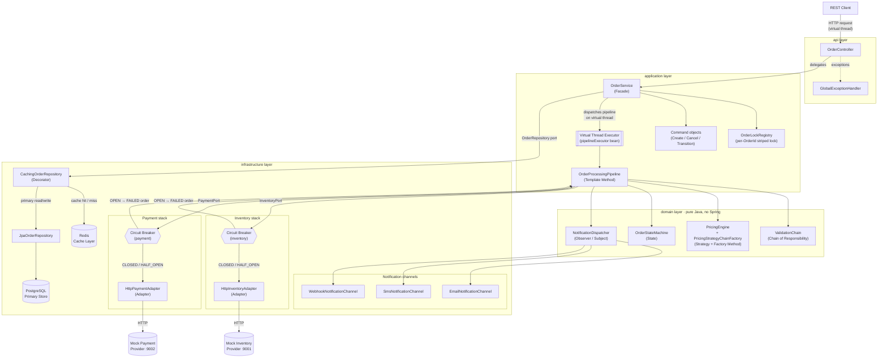

# Architecture

## Component Diagram

The diagram below shows the runtime data flow through the Dynamic Order Processing Service.
Annotations mark where the **Circuit Breaker** and **Virtual Thread Executor** are applied.

---

## Layer Descriptions

### `api` — HTTP binding

`OrderController` maps the five REST endpoints to `OrderService` calls and translates
domain exceptions to HTTP status codes via `GlobalExceptionHandler`. This layer owns DTO
types (`CreateOrderRequest`, `OrderResponse`, etc.) and Bean Validation annotations. It has
no business logic and no direct dependency on infrastructure.

Every inbound request is handled on a **Java 21 virtual thread** (enabled by
`spring.threads.virtual.enabled=true`), so thousands of concurrent requests can be in-flight
without exhausting platform threads.

### `application` — Use-case orchestration

`OrderService` (Facade) is the single entry point for the controller. It enforces
idempotency via `IdempotencyStore`, acquires a per-`OrderId` `ReentrantLock` through
`OrderLockRegistry` before any state-mutating operation, and delegates processing to
`OrderProcessingPipeline`.

`OrderProcessingPipeline` (Template Method) defines the fixed five-stage sequence:
**validate → price → reserve → pay → notify**. Each stage is dispatched on the
`pipelineExecutor` bean — a `newVirtualThreadPerTaskExecutor()` — so pipeline work never
blocks a platform thread.

Command objects (`CreateOrderCommand`, `CancelOrderCommand`, `TransitionOrderCommand`)
encapsulate each lifecycle action, ensuring every mutation is audited with an
`OrderStatusEvent`.

### `domain` — Business rules (pure Java)

The domain layer has zero Spring, JPA, Redis, or Resilience4j imports. This is what makes
property-based tests runnable as plain JUnit/jqwik tests without a Spring context.

- **`ValidationChain`** (Chain of Responsibility) runs registered `ValidationRule`
  implementations in sequence; the first failure transitions the order to `FAILED`.
- **`PricingEngine`** applies an ordered `List<PricingStrategy>` (Strategy) built by
  `PricingStrategyChainFactory` (Factory Method) from a profile name.
- **`OrderStateMachine`** (State) delegates transition guards to per-status `OrderState`
  implementations, enforcing the Requirement 6.1 graph and rejecting all outgoing edges
  from terminal states.
- **`NotificationDispatcher`** (Observer) fans out status-transition events to all
  registered `OrderEventListener` implementations; a failing channel is recorded and
  skipped without aborting delivery to remaining channels.

### `infrastructure` — Concrete adapters

- **`CachingOrderRepository`** (Decorator) wraps `JpaOrderRepository` with Redis
  cache-aside logic: read-through on miss, populate before return, evict on write. When the
  `cache` circuit breaker is OPEN, `isAvailable()` returns `false` and the decorator
  bypasses Redis, recording a `cache_degraded` event.
- **`HttpInventoryAdapter`** and **`HttpPaymentAdapter`** (Adapter) translate domain port
  calls to HTTP/JSON requests against the mock providers. Both are annotated with
  `@CircuitBreaker`; when the breaker is OPEN, `CallNotPermittedException` propagates to
  the pipeline, which transitions the order to `FAILED` with a `dependency_unavailable`
  reason and surfaces an HTTP 503 to the caller.
- **Notification channels** (`EmailNotificationChannel`, `SmsNotificationChannel`,
  `WebhookNotificationChannel`) implement `OrderEventListener` and are registered as Spring
  beans, making them discoverable by `NotificationDispatcher` without any code change to
  the dispatcher.

### Circuit Breaker placement

Two Resilience4j circuit breakers guard external calls:

| Breaker | Guards | OPEN consequence |
|---------|--------|-----------------|
| `inventory` | `HttpInventoryAdapter.reserve` / `release` | Order transitions to `FAILED`; HTTP 503 returned |
| `payment` | `HttpPaymentAdapter.authorize` / `voidAuthorization` | Order transitions to `FAILED`; HTTP 503 returned |
| `cache` | `RedisOrderCache` operations | Cache bypassed; reads/writes fall through to PostgreSQL |

### Virtual Thread Executor placement

| Location | Executor | Purpose |
|----------|----------|---------|
| Tomcat request threads | Spring Boot virtual-thread integration (`spring.threads.virtual.enabled=true`) | Each HTTP request runs on its own virtual thread |
| Pipeline stages | `pipelineExecutor` bean (`Executors.newVirtualThreadPerTaskExecutor()`) | Notification fan-out and any parallel pipeline work run on virtual threads |
